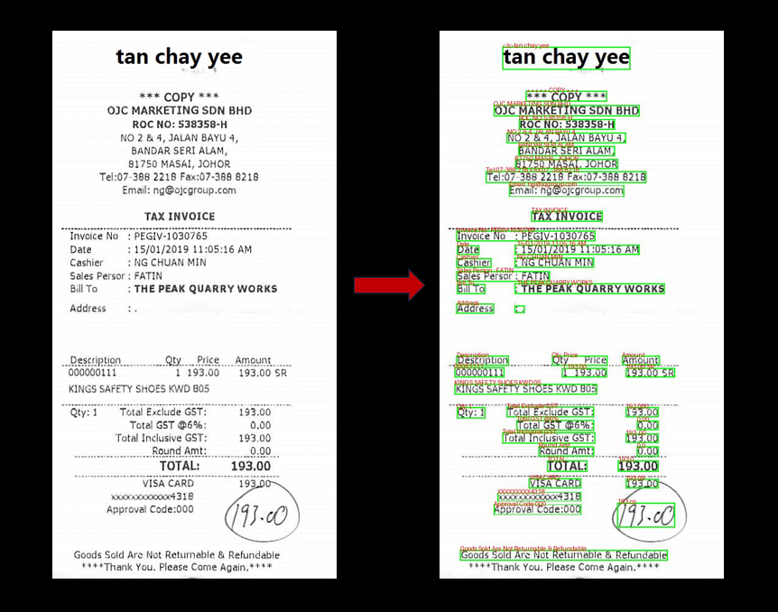

# OCR Project - Florence 2

< Microsoft Florence2 비전모델을 활용한 OCR >  
마이크로소프트에서 공개한 비전모델 **Florence2** 딥러닝 모델을 활용하여 개발한 **OCR** 프로그램입니다. 개발하며 테스트해본 결과 아직 한국어는 제대로 포착하지 못하였으나, 영어는 현재 공개된 오픈소스 (Tesseract, easyOCR, etc...) 만큼 좋은 성능을 보여준다고 생각됩니다.

추가학습 및 이미지 사전 전처리를 통하여 OCR를 한다면 보다 더 좋은 성능을 낼것으로 보여집니다.
(이 프로젝트에서는 이미지 전처리를 하지 않고 바로 원본을 Florence2 모델에 input으로 나온 결과입니다.)

검출된 데이터(영역 및 검출된 글자) 및 결과 사진는 result폴더에 저장됩니다.

 

## Output Examples:

 > result 폴더에 sample 결과물을 확인해볼 수 있습니다.

 

## Installation:
사전에 자신의 컴퓨터/서버 사양에 맞는 Pytorch를 설치하여 CUDA GPU연결를 해주셔야 합니다.
Florence2 모델은 따로 설치할 필요없이, HuggingFace - **transformers** 라이브러리를 설치하여 불러와주면 자동 다운로드 됩니다.

마이크로소프트 Florence2 모델은 HuggingFace에 공개되어 있습니다.
- Florence2 URL : https://huggingface.co/microsoft/Florence-2-large
- Pytorch URL : https://pytorch.org/get-started/locally/

 

**1. Requirements & Use:**
1. OS: Windows 11 (테스트된 환경) 
2. Python Version 3.10.0 설치
3. requirements.txt 필요/담긴 라이브러리 설치
4. 메인 디렉토리로 이동 및 CMD 실행
5. CMD:
    - python ./main.py [이미지 경로]
    - python main.py ./test_images/test.jpg 

 

**2. GPU Used:**
- NVIDIA GeForce RTX 3080 Ti Laptop GPU (16GB)
  - Florence2 Large Model: Minimum 12GB GPU Memory recomanded
  - Florence2 Base Model: Minimum 5GB GPU Memory recomanded

 

## Additional Use:
마이크로소프트 Florence2 Model로 다양한 이미지 인식/처리할 수 있습니다. 메서드 사용시 '< >' 안에 필요한 기능을 넣어주시면 됩니다. (참고로 프로젝트에 사용한 메서드는 "OCR_WITH_REGION 입니다.)

1. 설명:  
    - CAPTION
    - DETAILED_CAPTION
    - MORE_DETAILED_CAPTION

2. 객체 탐지:  
   - OB
   - CAPTION_TO_PHRASE_GROUNDING

3. 글자 인식 (OCR)  
   - OCR
   - OCR_WITH_REGION

4. 객체 영역 탐지:  
   - REFERRING_EXPRESSION_SEGMENTATION 

 

## 비고:
Florence2 모델을 학습시켜 한국어 인식을 높여 OCR 엔진으로 사용해도 괜찮을거 같습니다. 

예전 다른 오픈소스 모델을 통해 OCR를 프로젝트를 진행해봤던 경험상 위에 예시로 사용된 사진크기 및 화질로는 좋은 성능을 내지 못하였고, 추가적으로 더 나은 OCR성능을 이끌어내기위해 OpenCV로 전처리를 해주어도 성능은 크게 향상되지 못했습니다.

따라서, 이미지 전처리 모듈을 추가하여 Text를 더 뚜렷하게 만들어주는 과정을 거치면 더 잘 잡아낼것으로 생각합니다.

 
